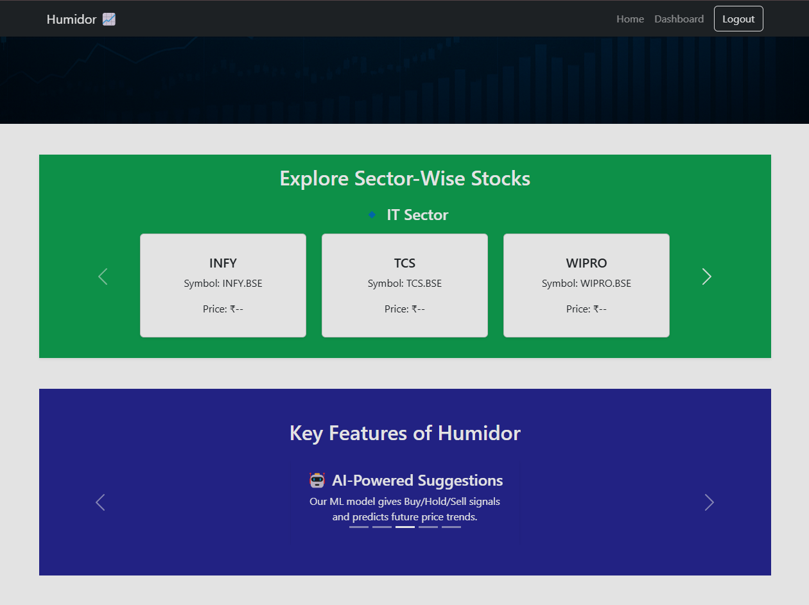
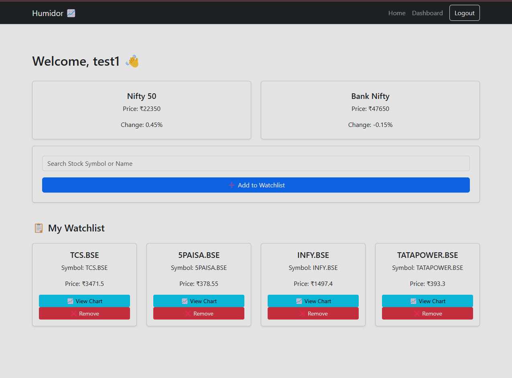
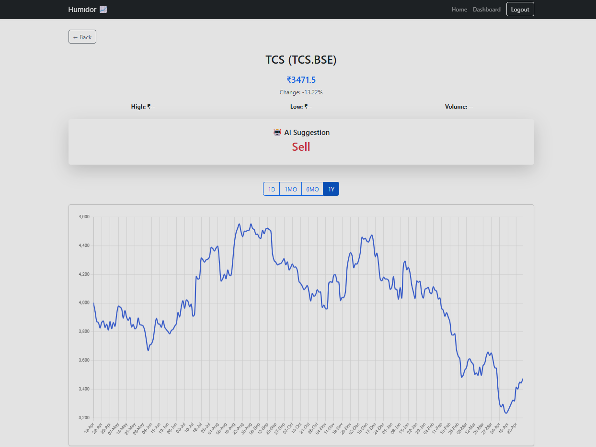

# 📊 Humidor – Indian Stock Market Dashboard

**Humidor** is a full-stack web application to **track Indian stocks**, **manage watchlists**, and **get ML-based investment suggestions**. It features real-time data integration (via Alpha Vantage API), interactive charts, and a secure login system.

---

## 🚀 Features

- 🔐 JWT-based Login & Signup  
- 📋 Personalized Watchlist with Add/Remove  
- 📈 Interactive Stock Chart with Timeframes  
- 🤖 AI-Powered Buy/Sell/Hold Predictions  
- 🔍 Autocomplete Search with 1000+ BSE Stocks  
- 🏢 Sector-wise Stock Carousel (static demo)  
- 📊 Dummy Indexes (Nifty, BankNifty)

---

## 🛠️ Tech Stack

- **Frontend**: React + React Bootstrap  
- **Backend**: Node.js / Express + FastAPI (for ML & Alpha Vantage)  
- **Database**: MongoDB  
- **Auth**: JWT  
- **Charts**: Chart.js  
- **ML Logic**: Simple trend-based suggestion model  
- **Stock API**: [Alpha Vantage](https://www.alphavantage.co)

---

## 📷 Screenshots

  
  

---
